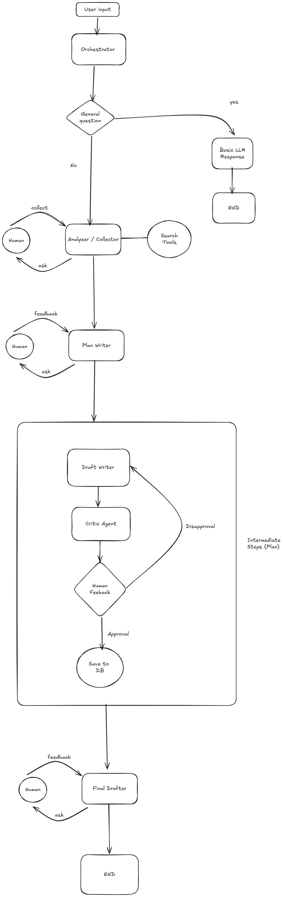

# 📝 Multi-Agent Content Creation Workflow

### Designing Agentic Systems - School Project

[](https://github.com/langchain-ai/langgraph)
[![Open in - LangGraph Studio](https://img.shields.io/badge/Open_in-LangGraph_Studio-00324d.svg?logo=data:image/svg%2bxml;base64,PHN2ZyB4bWxucz0iaHR0cDovL3d3dy53My5vcmcvMjAwMC9zdmciIHdpZHRoPSI4NS4zMzMiIGhlaWdodD0iODUuMzMzIiB2ZXJzaW9uPSIxLjAiIHZpZXdCb3g9IjAgMCA2NCA2NCI+PHBhdGggZD0iTTEzIDcuOGMtNi4zIDMuMS03LjEgNi4zLTYuOCAyNS43LjQgMjQuNi4zIDI0LjUgMjUuOSAyNC41QzU3LjUgNTggNTggNTcuNSA1OCAzMi4zIDU4IDcuMyA1Ni43IDYgMzIgNmMtMTIuOCAwLTE2LjEuMy0xOSAxLjhtMzcuNiAxNi42YzIuOCAyLjggMy40IDQuMiAzLjQgNy42cy0uNiA0LjgtMy40IDcuNkw0Ny4yIDQzSDE2LjhsLTMuNC0zLjRjLTQuOC00LjgtNC44LTEwLjQgMC0xNS4ybDMuNC0zLjRoMzAuNHoiLz48cGF0aCBkPSJNMTguOSAyNS42Yy0xLjEgMS4zLTEgMS43LjQgMi41LjkuNiAxLjcgMS44IDEuNyAyLjcgMCAxIC43IDIuOCAxLjYgNC4xIDEuNCAxLjkgMS40IDIuNS4zIDMuMi0xIC42LS42LjkgMS40LjkgMS41IDAgMi43LS41IDIuNy0xIDAtLjYgMS4xLS44IDIuNi0uNGwyLjYuNy0xLjgtMi45Yy01LjktOS4zLTkuNC0xMi4zLTExLjUtOS44TTM5IDI2YzAgMS4xLS45IDIuNS0yIDMuMi0yLjQgMS41LTIuNiAzLjQtLjUgNC4yLjguMyAyIDEuNyAyLjUgMy4xLjYgMS41IDEuNCAyLjMgMiAyIDEuNS0uOSAxLjItMy41LS40LTMuNS0yLjEgMC0yLjgtMi44LS44LTMuMyAxLjYtLjQgMS42LS41IDAtLjYtMS4xLS4xLTEuNS0uNi0xLjItMS42LjctMS43IDMuMy0yLjEgMy41LS41LjEuNS4yIDEuNi4zIDIuMiAwIC43LjkgMS40IDEuOSAxLjYgMi4xLjQgMi4zLTIuMy4yLTMuMi0uOC0uMy0yLTEuNy0yLjUtMy4xLTEuMS0zLTMtMy4zLTMtLjUiLz48L3N2Zz4=)](https://langgraph-studio.vercel.app/templates/open?githubUrl=https://github.com/langchain-ai/react-agent)
[](https://www.python.org/downloads/)
[](./LICENSE)

> A sophisticated multi-agent system for collaborative content creation with human-in-the-loop validation, built using LangGraph and powered by GPT-4o.



## 🎓 Academic Context

- **Course:** Designing Agentic Systems
- **Project Type:** School Project - Multi-Agent Orchestration
- **Key Concepts:** Agent Orchestration, Human-in-the-Loop, State Management, Vector Storage

---

## 🎯 Project Overview

This project implements a **step-by-step content creation system** using multiple specialized AI agents that collaborate to produce high-quality, human-validated content. Unlike simple chatbots or single-pass content generators, this system features:

- 🤖 **9 Specialized Agent Nodes** working in coordination
- 👥 **4 Human-in-the-Loop Checkpoints** for quality control
- 🔄 **Iterative Refinement Loop** for each content section
- 🔍 **Research Integration** with Serper API for web search
- 💾 **Vector Database Storage** using Pinecone for persistence
- 🎨 **Visual Workflow** via LangGraph Studio

---

## 🏗️ System Architecture

### Agent Roles

| Agent                  | Role             | Responsibility                                            |
| ---------------------- | ---------------- | --------------------------------------------------------- |
| **Orchestrator**       | Router           | Determines if query is simple Q&A or complex content task |
| **Basic LLM Response** | Quick Answers    | Handles straightforward questions directly                |
| **Analyzer/Collector** | Researcher       | Uses Serper API to gather web research data               |
| **Plan Writer**        | Strategist       | Creates structured content outline with numbered steps    |
| **Draft Writer**       | Content Creator  | Writes content for ONE step at a time                     |
| **Critic Agent**       | Quality Reviewer | Evaluates draft quality and provides feedback             |
| **Human Feedback**     | Quality Gate     | Approves or requests revisions for each step              |
| **Save to DB**         | Persistence      | Stores approved content in Pinecone vector database       |
| **Final Drafter**      | Polish Editor    | Refines and finalizes the complete content                |

### Workflow Flow

```
User Input
    ↓
Orchestrator
    ↓
┌───────────┴───────────┐
│                       │
Simple Question    Complex Task
│                       │
Basic LLM Response    Research (Serper API)
│                       ↓
│                   Plan Creation
│                   ↓ (HUMAN ✋ Approval)
│                   ┌───────────────────┐
│                   │ STEP-BY-STEP LOOP │
│                   │ (Per Plan Step)   │
│                   │                   │
│                   │ Draft → Critic    │
│                   │   ↓               │
│                   │ Human Review ✋   │
│                   │   ↓               │
│                   │ Approve/Revise    │
│                   └───────┬───────────┘
│                           │
│                   All Steps Done?
│                           ↓
│                     Save to DB
│                           ↓
│                   Final Polish
│                   ↓ (HUMAN ✋ Review)
│                           │
└───────────────────────────┘
                ↓
               END
```

---

## 🚀 Key Features

### 1. Step-by-Step Validation

Unlike traditional AI content generation that produces everything at once:

- Breaks content into discrete, manageable steps
- Writes and validates ONE step at a time
- Allows targeted revisions without redoing entire content
- Tracks progress: "Completed 3/5 steps"

### 2. Multi-Source Research

- **Serper API**: Google Search integration for current, accurate data
- **Tavily Search**: Backup search tool for comprehensive results
- **Iterative Research**: Can request additional research mid-workflow

### 3. Quality Assurance Loop

Every step goes through a 3-stage validation:

1. **AI Draft**: Content writer creates section
2. **AI Review**: Critic evaluates quality and suggests improvements
3. **Human Approval**: Final decision on acceptance or revision

### 4. Vector Database Integration

- Stores approved content in Pinecone
- Metadata includes: title, steps, plan, timestamp
- Ready for semantic search and retrieval
- Persistent storage across sessions

### 5. Dynamic Routing

Uses LangGraph's `Command` objects for:

- Conditional flow control
- Loop-back mechanisms
- State-based navigation

---

## 📦 Tech Stack

| Technology           | Purpose                       | Version |
| -------------------- | ----------------------------- | ------- |
| **LangGraph**        | Agent orchestration framework | 1.0+    |
| **OpenAI GPT-4o**    | Primary language model        | Latest  |
| **Serper API**       | Web search integration        | -       |
| **Pinecone**         | Vector database               | 6.0+    |
| **LangSmith**        | Tracing and debugging         | -       |
| **Python**           | Core language                 | 3.11+   |
| **LangGraph Studio** | Visual development            | Latest  |

---

## 🛠️ Installation & Setup

### Prerequisites

- Python 3.11 or higher
- OpenAI API key (Required)
- Serper API key (Optional but recommended)
- Pinecone API key (Optional)
- LangSmith API key (Optional)

### Step 1: Clone Repository

```bash
git clone https://github.com/YOUR_USERNAME/content-workflow-agent.git
cd content-workflow-agent
```

### Step 2: Install Dependencies

```bash
pip install -e .
```

This installs all required packages from `pyproject.toml`:

- langgraph
- langchain
- openai
- pinecone-client
- tavily-python
- httpx

### Step 3: Configure Environment

1. Copy the example environment file:

```bash
cp .env.example .env
```

2. Add your API keys to `.env`:

```bash
# Required
OPENAI_API_KEY=sk-your-openai-key-here

# Optional but recommended
SERPER_API_KEY=your-serper-key-here
PINECONE_API_KEY=your-pinecone-key-here
LANGSMITH_API_KEY=your-langsmith-key-here

# Optional
TAVILY_API_KEY=your-tavily-key-here
```

### Step 4: Run the Server

```bash
langgraph dev
```

Server will start at `http://127.0.0.1:2024`

### Step 5: Open LangGraph Studio

Visit: `https://smith.langchain.com/studio/?baseUrl=http://127.0.0.1:2024`

---

## 📖 Usage Guide

### Example 1: Simple Question

**Input:** "What is machine learning?"

**Flow:**

```
Orchestrator → Basic LLM Response → END
```

**Output:** Direct answer without research or planning.

### Example 2: Complex Content Creation

**Input:** "Write a comprehensive blog post about AI in healthcare"

**Flow:**

1. **Research Phase**

   - Serper searches: "AI healthcare applications", "medical AI benefits", etc.
   - Human reviews research, can request more

2. **Planning Phase**

   - Creates 5-step outline:
     - STEP 1: Introduction to AI in Healthcare
     - STEP 2: Current Applications
     - STEP 3: Benefits and Challenges
     - STEP 4: Case Studies
     - STEP 5: Future Outlook
   - Human approves plan

3. **Drafting Phase** (repeats 5 times)

   - Writes STEP 1 → Critic reviews → Human approves ✓
   - Writes STEP 2 → Critic reviews → Human requests revision → Rewrite STEP 2 → Human approves ✓
   - Writes STEP 3 → Critic reviews → Human approves ✓
   - Writes STEP 4 → Critic reviews → Human approves ✓
   - Writes STEP 5 → Critic reviews → Human approves ✓

4. **Finalization**
   - Saves complete content to Pinecone
   - Final polish and formatting
   - Human reviews final version
   - Complete!

---

## 📁 Project Structure

```
Article-agent-project/
├── src/
│   └── writer_agent/
│       ├── __init__.py                    # Package initialization
│       ├── content_workflow_graph.py      # Graph definition & routing
│       ├── content_workflow_nodes.py      # 9 agent node implementations
│       ├── content_workflow_state.py      # State management (TypedDict)
│       ├── tools.py                       # Search tools (Serper, Tavily)
│       └── utils.py                       # Helper functions
├── tests/                                 # Unit & integration tests
├── .env                                   # Environment variables (gitignored)
├── .env.example                           # Template for .env
├── langgraph.json                         # LangGraph configuration
├── pyproject.toml                         # Dependencies & metadata
├── CONTENT_WORKFLOW_README.md             # Detailed workflow docs
├── PINECONE_SETUP.md                      # Database setup guide
├── WORKFLOW_CHANGES.md                    # Change log
└── README.md                              # This file
```

---

## 🔑 API Keys & Setup Guides

### OpenAI (Required)

1. Sign up at https://platform.openai.com/
2. Create API key
3. Add to `.env`: `OPENAI_API_KEY=sk-...`

### Serper API (Recommended)

1. Sign up at https://serper.dev/
2. Get free tier: 2,500 queries/month
3. Add to `.env`: `SERPER_API_KEY=...`
4. See `WORKFLOW_CHANGES.md` for implementation details

### Pinecone (Recommended)

1. Sign up at https://www.pinecone.io/
2. Create project and get API key
3. Add to `.env`: `PINECONE_API_KEY=...`
4. See `PINECONE_SETUP.md` for full setup guide

### LangSmith (Optional)

1. Sign up at https://smith.langchain.com/
2. Create API key
3. Add to `.env`: `LANGSMITH_API_KEY=...`
4. Enables detailed tracing and debugging

---

## 🎨 LangGraph Studio

LangGraph Studio provides a visual interface for:

- **Graph Visualization**: See all nodes and edges
- **State Inspection**: View state at each step
- **Interrupt Handling**: Provide human feedback at checkpoints
- **Time Travel**: Rewind and replay from any state
- **Hot Reload**: Changes auto-update without restart

---

## 🧪 Testing

Run tests:

```bash
# All tests
pytest

# Unit tests only
pytest tests/unit_tests/

# Integration tests
pytest tests/integration_tests/
```

---

## 📚 Documentation

- **[CONTENT_WORKFLOW_README.md](./CONTENT_WORKFLOW_README.md)**: Detailed workflow explanation
- **[PINECONE_SETUP.md](./PINECONE_SETUP.md)**: Vector database configuration
- **[WORKFLOW_CHANGES.md](./WORKFLOW_CHANGES.md)**: Recent updates and changes

---

## 🎓 Educational Value

### Concepts Demonstrated

1. **Multi-Agent Orchestration**

   - Agent specialization and coordination
   - State sharing between agents
   - Conditional routing based on state

2. **Human-in-the-Loop Systems**

   - Strategic interrupt points
   - Feedback incorporation
   - Quality control gates

3. **State Management**

   - TypedDict for type safety
   - State updates and propagation
   - Step-by-step tracking

4. **Tool Integration**

   - External API calls (Serper, Pinecone)
   - Async operations
   - Error handling and fallbacks

5. **Graph-Based Workflows**
   - Node and edge definitions
   - Conditional edges
   - Command objects for dynamic routing

---

## 🐛 Troubleshooting

### Common Issues

**Issue:** `Path 'langgraph.json' does not exist`

- **Solution:** Ensure you're in the `react-agent-project` directory

**Issue:** `KeyError: 'draft_content'`

- **Solution:** Updated in latest version, pull latest changes

**Issue:** Serper API not working

- **Solution:** Check API key, falls back to Tavily automatically

**Issue:** Graph nodes not showing connections

- **Solution:** Server auto-reloads, refresh browser

---

## 🚀 Creating GitHub Repository

### Quick Setup

```bash
# Initialize git (if not already done)
git init

# Add all files
git add .

# Create initial commit
git commit -m "Initial commit: Multi-agent content workflow system"

# Create repository on GitHub
# Go to: https://github.com/new
# Repository name: content-workflow-agent
# Description: Multi-agent content creation system for CS 410 project
# Public/Private: Your choice
# DO NOT initialize with README (we already have one)

# Link to remote and push
git remote add origin https://github.com/YOUR_USERNAME/content-workflow-agent.git
git branch -M main
git push -u origin main
```

### What to Include

✅ **Include:**

- All source code (`src/`)
- Configuration files (`langgraph.json`, `pyproject.toml`)
- Documentation (`*.md` files)
- Tests (`tests/`)
- `.gitignore` file
- `.env.example` (template)
- `LICENSE` file

❌ **Exclude (.gitignored):**

- `.env` (contains API keys!)
- `__pycache__/` directories
- `.langgraph_api/` cache
- `*.egg-info/` build artifacts

---

## 🤝 Contributing

This is a school project, but suggestions are welcome:

1. Fork the repository
2. Create a feature branch
3. Commit your changes
4. Push to the branch
5. Open a Pull Request

---

## 📄 License

This project is licensed under the MIT License - see the [LICENSE](LICENSE) file for details.

---

## 👥 Authors

- **ouzema** - Designing Agentic Systems Project

---

## 🙏 Acknowledgments

- **LangChain Team** for LangGraph framework
- **Course Instructor** for project guidance
- **OpenAI** for GPT-4o model
- Template based on [LangGraph ReAct Agent](https://github.com/langchain-ai/react-agent)

---

**⭐ If this project helped you understand multi-agent systems, consider starring the repository!**
